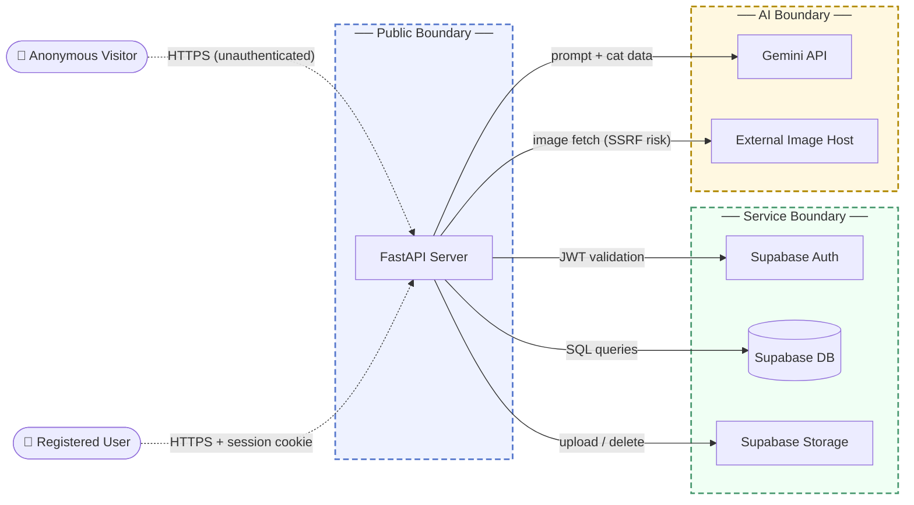

# Threat Model: Kisa Stray Cat Rescue Platform

## 1. Overview

Kisa is a community-driven web application that helps volunteers track, manage, and rescue stray cats. Users can register cat profiles with location data, log sightings, file SOS reports, upload photos, and use Google Gemini AI to generate cat summaries, analyze images, and suggest duplicate matches. The backend is a FastAPI application rendered with Jinja2 templates, backed by Supabase (authentication, PostgreSQL, and object storage) and the Google Gemini API.

Main components:
- FastAPI web server: serves both HTML pages and a REST API
- Supabase Auth: email/password authentication with JWT session tokens
- Supabase Database: stores cat profiles, sightings, SOS reports, comments, and user profiles
- Supabase Storage: hosts uploaded cat images in a public bucket
- Google Gemini AI API: powers cat summaries, image analysis, and duplicate matching

This model covers the FastAPI application layer, its trust relationships with Supabase and Gemini, and the threats arising from how the application grants (or fails to grant) access to its resources.

## 2. Trust Boundaries

- The API trusts any caller to read and write community data on most endpoints. No authentication dependency is declared on the cats, sightings, SOS, comments, search, map, feed, or Gemini routes; these are reachable by anonymous network callers.
- The API trusts cookie-presented session tokens as proof of identity on protected page and user-profile routes. Enforcement: the `get_current_user` helper calls `supabase.auth.get_user(access_token)` on each request, delegating validation to Supabase.
- The FastAPI application trusts Supabase as the authoritative backend for all persistence and auth decisions. Enforcement: a single shared Supabase client authenticates with a static API key loaded from environment variables at startup.
- The Gemini AI service trusts any image URL supplied by the caller and fetches it server-side. Enforcement: none beyond a 10-second HTTP timeout.
- Supabase Storage trusts the application's service key for all bucket operations, including deletes. Enforcement: the SUPABASE_KEY credential is checked by the Supabase service; no per-resource ownership check is applied in application code.

## 3. Threat Scenarios

**Unauthenticated write access to community data**
All write endpoints for cats, sightings, SOS reports, and comments are reachable without a session. An anonymous attacker can create, modify, or delete any record in the platform. The consequence is full corruption or destruction of the community's operational dataset, including cat profiles and active rescue requests.
- Risk: High likelihood, High impact
- Mitigation: Enforce authentication on all mutating endpoints and restrict update and delete operations to the record's owner or an administrator role.
- Validation: Pentest: send unauthenticated POST, PATCH, and DELETE requests to the cats, sightings, SOS, and comments endpoints and verify all are rejected with a 401.

**SSRF via attacker-controlled image URL in Gemini analysis**
The `/gemini/analyze-image` endpoint accepts a caller-supplied URL and unconditionally fetches it server-side before forwarding the bytes to Gemini. An attacker can supply an internal address such as a cloud metadata service or a Supabase management endpoint. If successful, the server's response (including credentials or internal service data) may surface in error messages or AI output.
- Risk: High likelihood, High impact
- Mitigation: Validate and allowlist accepted image URL origins to the application's own Supabase storage public URL prefix before performing any outbound fetch.
- Validation: Pentest: submit URLs targeting the cloud instance metadata service and internal private RFC-1918 addresses and confirm all are rejected before any network request is issued.

**Arbitrary file deletion without authentication or ownership check**
The `/images/delete` endpoint accepts a `file_path` query parameter and deletes the named object from Supabase Storage. No authentication is required and no ownership relationship is verified. An attacker who can observe or guess any valid storage path can permanently destroy all uploaded cat images.
- Risk: High likelihood, High impact
- Mitigation: Require an authenticated session on the delete endpoint and verify that the requesting user owns the file being deleted before issuing the storage removal call.
- Validation: Pentest: send an unauthenticated DELETE request with a known file path and confirm the request is rejected; then confirm an authenticated non-owner request is also rejected.

**Prompt injection via user-controlled cat data sent to Gemini**
The summary and match endpoints serialize user-supplied cat fields, including free-text description fields, directly into Gemini prompts without sanitization. An attacker who controls a cat record can embed instruction strings that override the intended prompt behavior, potentially producing misleading match results or causing the model to disclose prompt content. Because cat creation currently requires no authentication, this attack requires no prior credentials.
- Risk: High likelihood, Medium impact
- Mitigation: Enforce explicit system-level instructions that forbid prompt overrides, and constrain user-supplied fields to a bounded set of values before they are inserted into any prompt string.
- Validation: Code review: confirm prompt builders do not interpolate raw free-text fields without filtering; pentest: place instruction strings in a cat description and observe whether Gemini follows them.

**Session token interception enabling account takeover**
The application issues access and refresh tokens as HTTP cookies. An attacker who can observe or intercept these tokens obtains full session access for the token's lifetime. Because the refresh token is long-lived and there is no visible server-side revocation path tied to credential changes, the window of exposure persists even after the legitimate user updates their password.
- Risk: Medium likelihood, High impact
- Mitigation: Set the `secure` and `SameSite=Strict` flags on session cookies, enforce HTTPS exclusively, and trigger Supabase session invalidation for all active sessions when a user changes credentials.
- Validation: Configuration audit: confirm `secure=True` is set on both cookie writes; automated test: change a test account's password and confirm the prior access token is rejected on the next API call.

## 4. Architectural Fragilities

Authorization is absent at the data layer. The application uses a single Supabase client, authenticated with one static service key, for every operation across all users. No Supabase row-level security (RLS) policies are applied to enforce per-user or per-owner data scoping at the database level. All authorization decisions therefore depend entirely on application-layer guards that, for the majority of routes, are not present. A caller that reaches any database-touching endpoint can read or write any row in the relevant table with no secondary control standing between the request and the data. If a single route is misconfigured or a new route is added without an auth check, the full dataset is exposed with nothing to contain the blast radius.
